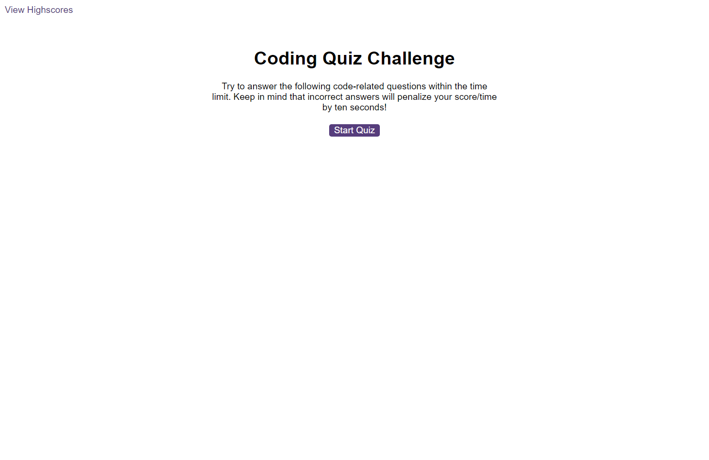
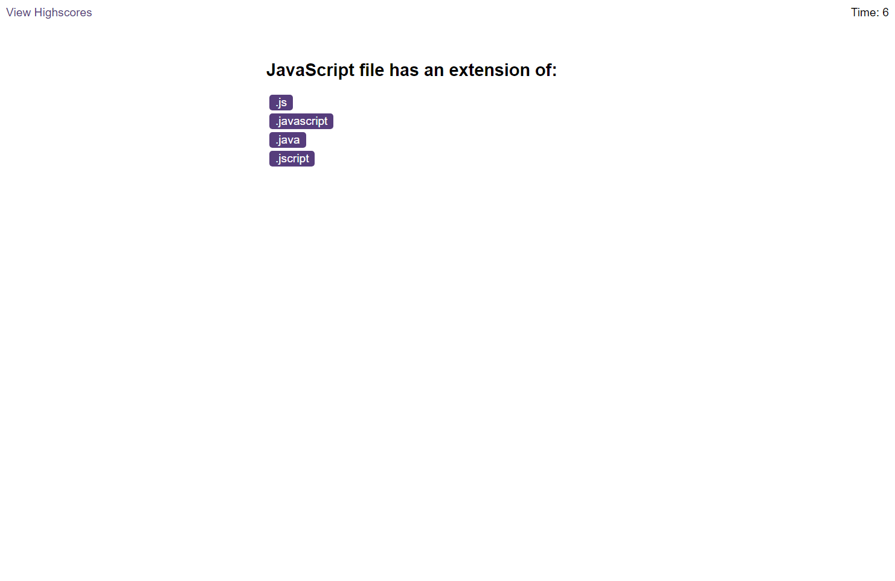

# Code Quiz

## Table of contents

- [Overview](#overview)
  - [The challenge](#the-challenge)
  - [Mock-up](#mock-up)
  - [Website](#website)
- [My process](#my-process)
  - [Built with](#built-with)
  - [What I learnt](#what-i-learnt)

## Overview

### The challenge
This project is to see create a timed code quiz on Javascript. It currently holds a start screen with a start button that when clicked, a timer starts and the first question appears. The questions in the quiz contain buttons for each answer and when a choice has been clicked, the next question appears. If the answer clicked was incorrect, then 10 seconds is subtracted from the clock. The quiz ends when all the questions are answered or the timer reaches 0.

### Mock-up

The following image shows the web application's appearance and functionality:

### Website
Deployed application: https://yvonne0711.github.io/code-quiz/  

## My process

### Built with
- HTML
- CSS
- JavaScript

### What I learnt
- Several HTML and JavaScript files all in one project
- Adding event listeners on click of the start and answer buttons
- Using the [audio `.play()` method](https://www.w3schools.com/jsref/met_audio_play.asp#:~:text=The%20play()%20method%20starts,%2C%20attached%20on%20the%20audio) for playing audio files
- Use of several functions and event listeners and event listeners within functions
- Using the [classList property](https://developer.mozilla.org/en-US/docs/Web/API/Element/classList) to return the DOM to access the class attributes of an element e.g. using the `.add()` and `.remove()` methods
- Use of `setInterval` for the timer
- When the quiz ends, it currently doesn't display the score and doesn't allow the user to save their intitials with their score